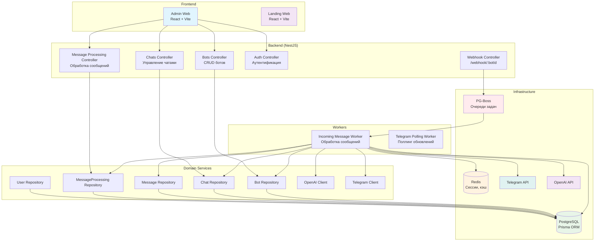
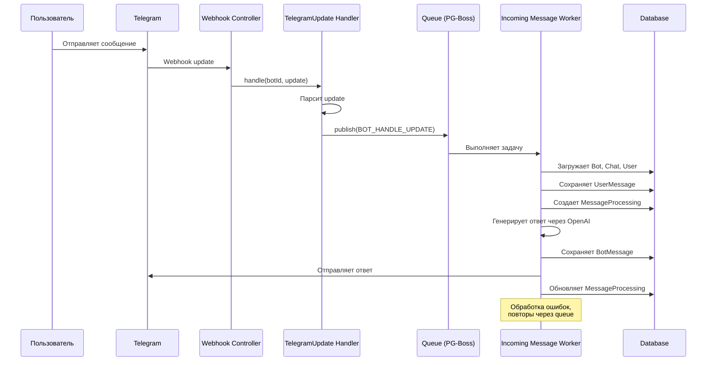
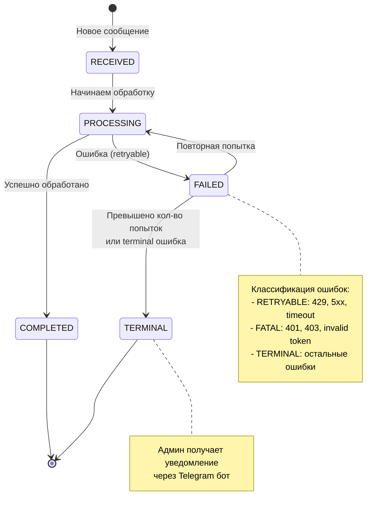
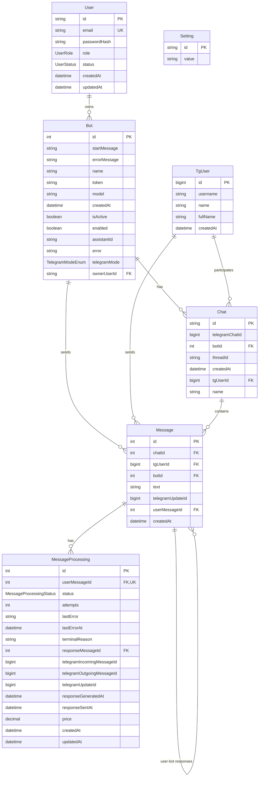
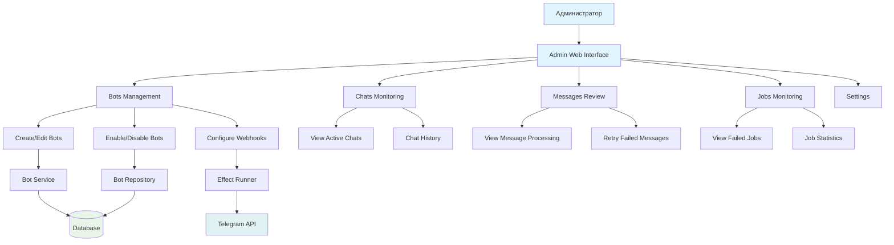
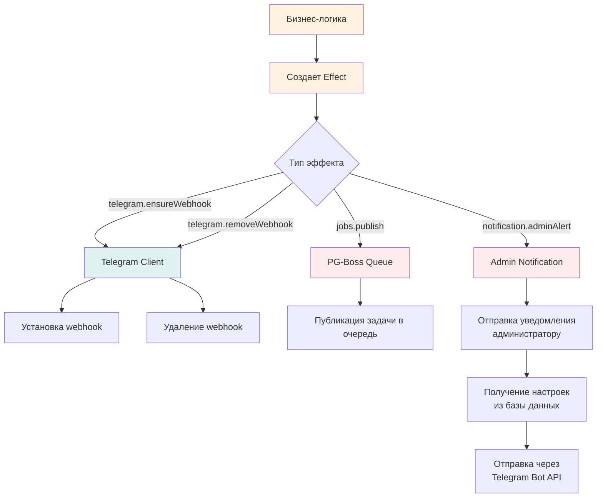

# Схемы потоков данных приложения Kotodom GPT

## 1. Общая архитектура приложения



## 2. Поток обработки входящих сообщений



## 3. Детальный поток генерации ответов

```mermaid
flowchart TD
    A[Получено сообщение от пользователя] --> B{Это команда?}

    B -->|Да| C[Обработать команду]
    C --> D[/start] --> E[Отправить startMessage]
    C --> F[/help] --> G[Отправить HELP_TEXT]
    C --> H[/refresh] --> I[Сбросить threadId]

    B -->|Нет| J[Отправить в OpenAI]

    J --> K[Создать/получить thread]
    K --> L[Добавить сообщение в thread]
    L --> M[Запустить assistant run]
    M --> N[Ожидать завершения]

    N --> O{Status = completed?}
    O -->|Да| P[Получить ответ]
    O -->|Нет| Q{Status = failed?}
    Q -->|Да| R[Ошибка генерации]
    Q -->|Нет| N

    P --> S[Сохранить ответ в БД]
    S --> T[Отправить в Telegram]

    R --> U[Отметить как TERMINAL в MessageProcessing]

    style A fill:#e8f5e8
    style T fill:#e8f5e8
    style U fill:#ffebee
```

## 4. Система очередей и обработки ошибок



## 5. Схема базы данных



## 6. Поток администрирования



## 7. Система эффектов и асинхронных операций



## 8. Мониторинг и логирование

```mermaid
flowchart TD
    A[Приложение] --> B[Pino Logger]

    B --> C[Console Output]
    B --> D[Logtail Service]

    A --> E[Health Checks]
    E --> F[/health endpoint]

    A --> G[Метрики]
    G --> H[PG-Boss Job Stats]
    G --> I[Database Connection]
    G --> J[External API Status]

    H --> K[Failed Jobs Count]
    I --> L[Connection Pool Status]
    J --> M[OpenAI Rate Limits]
    J --> N[Telegram API Status]

    style E fill:#e8f5e8
    style F fill:#e8f5e8
    style B fill:#fff3e0
    style D fill:#fff3e0
```

